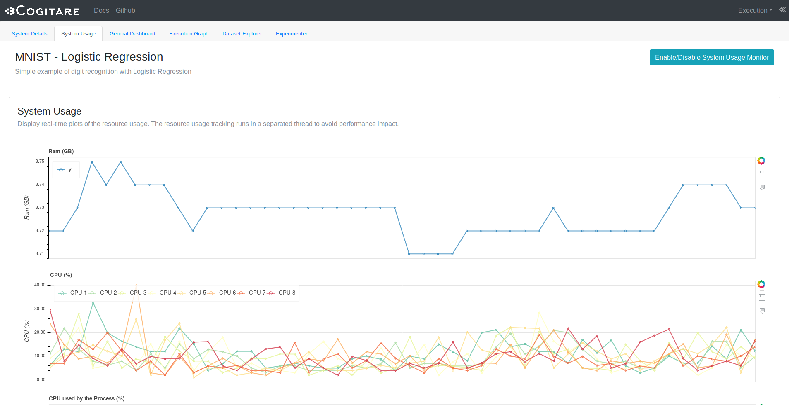

Cogitare Monitor
================

.. warning:: Monitor is in active development, so this documentation may change
    future releases.

**Cogitare Monitor** is a web tool to analyze the model training in real time. Currently, is a working in progress, but the main objectives of cogitare monitor are:

* A unified tool to analyze the execution of multiple models and multiples instances of the same model in the same browser tab
* Support multiple clients connected at the same time
* Get real-time data about the machine resources (CPU/GPU/RAM usage, and others)
* Plot model loss and custom metrics
* Plot and analyze model weights
* Analyze, schedule, and run multiples instances of the same model with different parameters
* Debug the execution graph
* Analyze and debug the dataset. Check the loading time per bach, the cache usage (for AsyncLoader), and get raw samples to display in the monitor
* Interface to plot custom graphs using Bokeh. A tab to display user-defined graphs (a PlottingBokeh plugin) in the monitor.

How to Use
----------

.. TODO:: write tutorial

Creating a Custom Plugin
------------------------

.. TODO:: write tutorial
