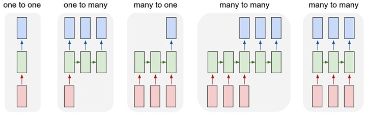

Sequential Model
================

Cogitare provides the Sequential Model interface, that allows you to train and evaluate
sequential models (many-to-many, and many-to-one) easily.

SequentialModel is an extension of :class:`~cogitare.Model`. It's recommended
to read the :class:`~cogitare.Model` docs first.

Implementing a Sequential Model (Many-to-Many, Many-to-One)
-----------------------------------------------------------

To implement a sequential model, you must extend the :class:`cogitare.SequentialModel` class and
implement the :meth:`cogitare.SequentialModel.forward`, :meth:`cogitare.SequentialModel.loss`, and
:meth:`cogitare.SequentialModel.get_initial_state` methods.

The forward method will receive the batch of samples at the current timestep and the current hidden state.
In this way, it is necessary to implement the forward pass through the network in this method,
and then return the output and the new hidden state of the net.

The loss method will receive the output of the :meth:`cogitare.SequentialModel.forward`
and the batch received from iterator, apply a loss function, compute and return
it.

As a simple example, to implement a `RNN-Char` that generates text char by
char, it can be implemented as follows::

    import nltk
    from cogitare import SequentialModel
    from cogitare.data import SequentialDataSet
    import torch.nn as nn
    from torch.autograd import Variable
    import torch.nn.functional as F
    import torch
    import torch.optim as optim
    import cogitare

    cogitare.seed(123)

    class RNNChar(SequentialModel):

        def __init__(self, dict_size, embedding_size, hidden_size,
                     dropout, use_cuda=True):
            super(RNNChar, self).__init__()
            self.hidden_size = hidden_size
            self.embedding_size = embedding_size
            self.use_cuda = use_cuda
            self.dropout = dropout

            # char embedding
            self.embedding = nn.Embedding(dict_size, embedding_size)
            # char embedding -> rnn
            self.rnn = nn.LSTMCell(embedding_size, hidden_size)
            # rnn output -> next-char prediction
            self.h2o = nn.Linear(hidden_size, dict_size)

        def get_initial_state(self, batch):
            v1 = Variable(torch.zeros(len(batch), self.hidden_size))
            v2 = Variable(torch.zeros(len(batch), self.hidden_size))

            if self.use_cuda:
                v1 = v1.cuda()
                v2 = v2.cuda()

            return v1, v2

        def forward(self, data, prev_hidden, timestep, seqlen):
            # seq is a tuple with (x_data_t, y_data_t)
            # we forward the x value
            seq = data[0]
            seq = Variable(torch.LongTensor(seq).view(len(seq), -1))
            if args.cuda:
                seq = seq.cuda()

            # get the char embedding, compute the output and the new hidden
            # states
            i2e = self.embedding(seq).squeeze(1)
            i2e = F.dropout(i2e, p=self.dropout)
            ot, ht = self.rnn(i2e, prev_hidden)
            output = self.h2o(ot)

            # returns the prediction and the new hidden state
            return F.log_softmax(output), (ot, ht)

        def loss(self, output, sample, hidden, timestep, seqlen):
            # here, we are using a Many-to-One RNN. If you want to use
            # Many-to-Many, just remove the following if
            if timestep != seqlen:
                return None

            # get expected output, where sample is (x_data_t, y_data_t)
            expected = sample[1]
            expected = Variable(torch.LongTensor(expected).view(args.batch_size))
            if args.cuda:
                expected = expected.cuda()

            # returns the loss at the current timestep
            return F.nll_loss(output, expected)

Notice that in the implementation above, it expects that each batch
is composed of a tuple (x_data_t, y_data_t). It will be called for each
timestep for each batch in the dataset.

Also, the loss function only returns a value when it is in the last timestep (
when timestep == seqlen). So it will behave as a Many-to-One model. If you want
a Many-to-Many, remove the if from the code above and return the loss for each
input.

To load the cada, it's recommended to use the
:class:`cogitare.data.SequentialDataSet`. It can be used as follows::

    SEQ_LEN = 100
    USE_CUDA = True
    BATCH_SIZE = 32

    def get_sample(idx):
        return raw[idx:idx + SEQ_LEN]

    def get_output(idx):
        return [raw[idx + SEQ_LEN]] * SEQ_LEN

    # load the data from nltk
    corpus = nltk.corpus.gutenberg.raw()
    raw = tuple(bytearray(corpus, encoding='utf8'))
    total_samples = len(raw) - SEQ_LEN - 1

    ds = SequentialDataSet([get_sample, get_output], batch_size=BATCH_SIZE, drop_last=True,
                           total_samples=total_samples)

    # split the data into two datasets
    ds_train, ds_test = ds.split(0.9)

Now, to train the model::

    optimizer = optim.Adam(rnn.parameters())
    rnn.register_default_plugins()

    rnn = RNNChar(255, 64, 128, 0.5, USE_CUDA)
    if USE_CUDA:
        rnn = rnn.cuda()
    rnn.learn(ds_train, optimizer, ds_test, max_epochs=10)
    rnn.save('model.pt')

    print('Model trainined!')
    input()

To use this model latter, you can load it from disk using::

    rnn = RNNChar(255, 64, 128, 0.5, USE_CUDA)
    rnn.load('model.pt')

and make new predictions using::

    output = rnn.predict(...)

API
---

.. autoclass:: cogitare.SequentialModel
    :members:
    :show-inheritance:
    :inherited-members:
